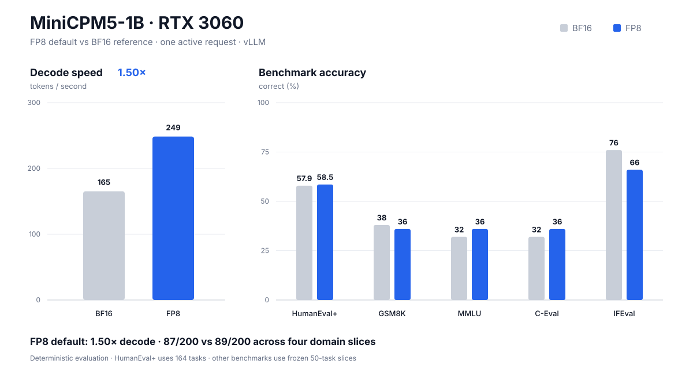

# MiniCPM5-1B on RTX 3060

A reproducible vLLM profile for fast **single-request** inference with
[`openbmb/MiniCPM5-1B`](https://huggingface.co/openbmb/MiniCPM5-1B) on one
NVIDIA RTX 3060 12 GB.



## Result

| Profile | Median decode | Relative speed | HumanEval+ | Frozen cross-domain suite |
| --- | ---: | ---: | ---: | ---: |
| BF16 reference | 165.39 tok/s | 1.000× | 95/164 | 89/200 |
| **Online block FP8** | **248.52 tok/s** | **1.503×** | **96/164** | **87/200** |

The recommendation is deliberately a **speed-quality tradeoff**, not a
no-degradation claim. HumanEval+ contained eight BF16→FP8 losses and nine
gains. The 200-task GSM8K/MMLU/C-Eval/IFEval screen contained 12 losses and 10
gains; its largest domain drop was IFEval, from 38/50 to 33/50.

## What is released

- `recommended`: online block FP8, Marlin linear kernels, Triton attention;
- `safe-bf16`: the unquantized serving reference and fallback;
- an RTX-3060-aware launcher that refuses to download model weights;
- the frozen evaluation specifications and document-hash manifest;
- task-level paired comparison receipts;
- the chart renderer and CPU-safe tests.

The model weights are unchanged and are **not** redistributed here. This is why
the primary artifact is a GitHub runtime/evidence repository rather than a new
Hugging Face model repository.

## Quick start

The measured environment used Linux, one RTX 3060 12 GB, vLLM `0.27.1`,
PyTorch `2.13.0+cu130`, and model revision
`4e9de7a0778dc1c362e983e6858f0e77542cbdca`.

Download the official checkpoint directly on the GPU machine:

```bash
hf download openbmb/MiniCPM5-1B \
  --revision 4e9de7a0778dc1c362e983e6858f0e77542cbdca \
  --local-dir /workspace/models/MiniCPM5-1B
```

Install the measured runtime, then launch the recommended profile:

```bash
python3 -m venv .venv
source .venv/bin/activate
pip install -r requirements-gpu.txt

export MINICPM5_MODEL_PATH=/workspace/models/MiniCPM5-1B
./serve --profile recommended --host 127.0.0.1 --port 8000
```

Use the BF16 fallback by changing only the profile:

```bash
./serve --profile safe-bf16 --host 127.0.0.1 --port 8000
```

Inspect the complete command without starting vLLM:

```bash
./serve --profile recommended --model "$MINICPM5_MODEL_PATH" --dry-run
```

The launcher verifies that one RTX 3060 12 GB is present. Other GPUs require
`--allow-unsupported-gpu` and must be benchmarked separately.

## Benchmarks and evidence

Read [the benchmark protocol](docs/BENCHMARKS.md) before interpreting the
numbers. Machine-readable artifacts are under [`results/`](results/):

- [`release-summary.json`](results/release-summary.json): release decision;
- [`humanevalplus-comparison.json`](results/humanevalplus-comparison.json):
  complete 164-task paired comparison;
- [`release-intelligence-comparison.json`](results/release-intelligence-comparison.json):
  complete 200-task paired outcomes;
- [`release-intelligence-manifest.json`](results/release-intelligence-manifest.json):
  frozen dataset revisions and document hashes.

Regenerate the checked-in chart from the decision JSON:

```bash
python3 scripts/render_benchmark_chart.py \
  --decision results/release-summary.json \
  --output docs/assets/benchmark-summary.svg
```

Run the CPU-safe validation suite:

```bash
python3 -m unittest discover -s tests -p 'test_*.py' -v
```

The GPU evaluation workflow is documented in
[`docs/BENCHMARKS.md`](docs/BENCHMARKS.md).

## Claim boundary

These measurements apply directly only to the pinned checkpoint, software,
single-request workload, and tested RTX 3060. The 50-task domain slices are
release screens, not official full-leaderboard reproductions. Deterministic
decoding removes sampling variance, but finite task selection still leaves
uncertainty about general model quality.

## Attribution and licenses

This project is independent research and is not an official OpenBMB release.
The code in this repository is MIT licensed. MiniCPM5-1B is published by
OpenBMB under Apache-2.0; obtain the model and its terms from the
[official model page](https://huggingface.co/openbmb/MiniCPM5-1B).
